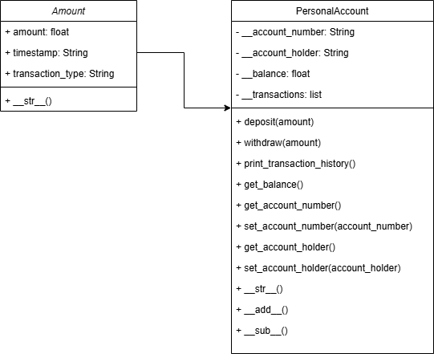

# Personal Account Management

## Objective
#### This project is a Python program for managing a personal bank account. It demonstrates the use of Object-Oriented Programming (OOP) concepts such as classes, objects, methods, and encapsulation.

## Features
- #### Create and manage a personal account
- #### Deposit and withdraw money
- #### Track transaction history
- #### Check account balance

## Classes
### 1. Amount
#### This class represents a transaction, including:

- #### amount: The transaction amount

- #### transaction_type: The type of transaction (DEPOSIT or WITHDRAW)

- #### timestamp: The date and time of the transaction

### Methods:

#### __str__(): Returns a string representation of the transaction

###  2. PersonalAccount
#### This class manages a bank account, including deposits, withdrawals, and transaction history.

### Attributes:

- #### __account_number: Unique account identifier

- #### __account_holder: Name of the account holder

- #### __balance: Current account balance

- #### __transactions: List of all transactions

### Methods:

- #### deposit(amount): Deposits money into the account

- #### withdraw(amount): Withdraws money if sufficient funds are available

- #### print_transaction_history(): Prints all transactions

- #### get_balance(): Returns the current balance

- #### get_account_number(): Retrieves account number

- #### set_account_number(account_number): Updates the account number

- #### get_account_holder(): Retrieves account holder’s name

- #### set_account_holder(account_holder): Updates the account holder’s name

- #### __str__(): Returns a string representation of the account

- #### __add__(amount): Overloads + to perform a deposit

- #### __sub__(amount): Overloads - to perform a withdrawal

## UML Class Diagram
[personal_account_uml.png]

## Test Cases
#### Here are some test cases to verify the functionality:

### Create Personal Account:
#### Input:
```python
my_account = PersonalAccount(account_number=230121021, account_holder='Iman Mashrapov')
print(my_account)
```

#### Output:
```ssh
Account number: 230121021, Account holder: Iman Mashrapov, Balance: 0.0
```

### Deposit Money

#### Input:
```python
my_account.deposit(1000)
my_account.deposit(200)
print(f"The balance is {my_account.get_balance()}")
```

#### Output:
```ssh
The balance is 1200.0
```

### Withdraw Money

#### Input:
```python
my_account.withdraw(700)
my_account.withdraw(100)
print(f"The balance is {my_account.get_balance()}")
```
#### Output:
```ssh
The balance is 400.0
```

### Withdraw More Than Balance

#### Input:
```python
my_account.withdraw(10000)
```

#### Output:
```ssh
Amount exceeds the current balance, all balance (400.0) is withdrawn
```

### Transaction History

#### Input:
```python
my_account.print_transaction_history()
```

#### Output:
```ssh
Amount: 1000, Time: 2025-02-20 13:39:22.514225, Transaction_type: DEPOSIT
Amount: 200, Time: 2025-02-20 13:39:22.514225, Transaction_type: DEPOSIT
Amount: 700, Time: 2025-02-20 13:39:22.514225, Transaction_type: WITHDRAW
Amount: 100, Time: 2025-02-20 13:39:22.514225, Transaction_type: WITHDRAW
Amount: 400.0, Time: 2025-02-20 13:39:22.514225, Transaction_type: WITHDRAW
```


